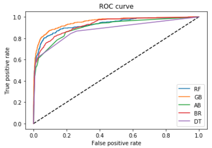
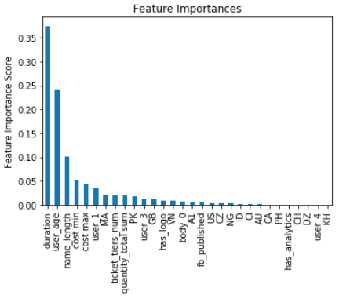

# Fraud Detection - Project Scope

## Introduction
Company X is a company that runs a web based marketplace for events. 
They create a platform that makes it easy for event hosts to list their
event, sell/distribute tickets, and collect revenue. Company X is 
experiencing problems with fraudulent event listings in their platform. 
There have been cases where users have bought tickets to fake events and 
payouts have been made to fraudulent hosts. In these cases, Company X is
responsible to reimburse their users for lost value (alternatively they 
can choose to lose public trust and shut their doors). To avoid this 
problem, the company is now dedicating costly resources to investigate 
potential fraud listings and shut them down.

As such, the task is to provide a scalable solution to handle fraudulent event listings. 

### The problem: losing money to fraud


## Scope:
* Explore available data
* Perform EDA to determine signal in various features
* Develop pipeline to encapsulate cleaning, transforming, and splitting of data
* Train a suite of models and compare accuracy
* Select top performing model and tune hyperparameters to optimize for recall
* Create a dashboard show the results.

#### Create a website (website and database were done using AWS, *they are no longer active*)
* Develop web site to present visualizations on the problem (link: http://54.84.68.72:2222/) 
* Include API in the website to receive new live data from client
* Create database to store data
* Call data from database, clean it, and run model to generate a prediction and present it on the web site


## Exploratory Data Analysis

* Number of Observations: 14337
* Number of Variables: 43
* Fraud Rate:  9%

* Variables used: 10
* Engineered Variables: 21

## Models

Chose 5 different models for this project:
* Random Forest
* Gradient Boosting
* AdaBoost
* Bagging 
* Decision Tree



Gradient Boosting performed the best so we will focus on this model.

* Accuracy : 0.956
* AUC Score: 0.952
* AUPRC    : 0.807

Precision and Recall vary based on the chosen threshold therefore they are not listed.

Here are is the Feature Importance Graph (Some variables can be removed since we can clearly see they did not provide any value to our Model)




## Classification Prescriptions
The prediction probabilities were analyzed to determine valuable thresholds for high, medium, and low risk. 
    
* High risk events can have an automatic pause put on their account until an expert at the company can review it more closely. 
* Medium risk will be flagged and events will be reviewed by the investigation team at the company.
* Low Risk events will be be ignored.

## Recommended Thresholds
* High Risk >= 0.6
* Medium Risk >= 0.062
* low Risk < 0.062

### Model Threshold of 0.6
* Captures 52.2% of all fradulent Activities
* Requires 5.1% of all transactions be looked at
* Out of that 5.1%, 91.3% will be fraud

### Model Threshold of 0.062
* Captures 86.9% of all fradulent Activities
* Requires 16.2% of all transactions be looked at
* Out of that 16.2%, 47.6% will be fraud

## Dashboard
Created a Dashboard using Tabluau that allows the client to chose their desired threshold and average fraud cost

[Access the dashboard here](https://public.tableau.com/app/profile/daniel.vega8600/viz/Fraudify/Summary)

```python

```
